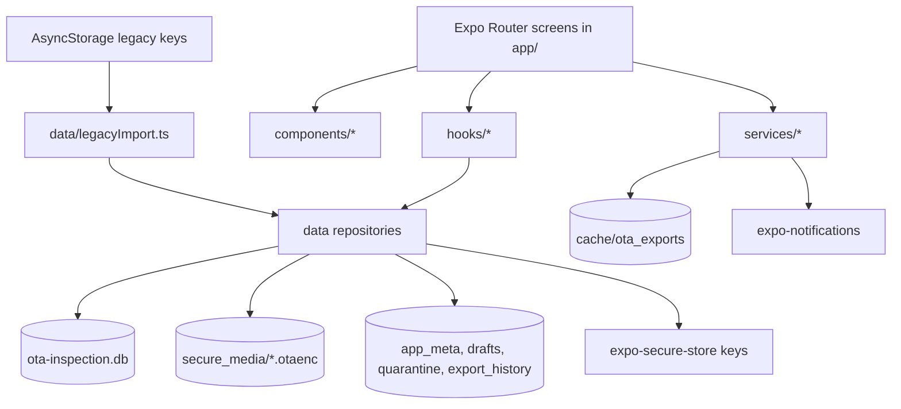

# OTAInspectionApp Architecture And Data Flow

## High-Level Architecture

## Important Truths Before Reading The Flow

- The app is local-first and has no backend.
- The runtime database is currently plain SQLite after startup migration logic, even though SQLCipher support is still configured in `app.json` and older docs still describe an encrypted live database.
- Media files and backup/archive artifacts are still encrypted separately from the live database.
- The main orchestration entrypoint is `data/DataProvider.tsx`.

## Storage Map

| Storage location | What lives there | Current behavior |
| --- | --- | --- |
| `ota-inspection.db` plus `-wal` / `-shm` | inspections, child rows, drafts, settings meta, quarantine, export history | live metadata store; plain SQLite at normal runtime |
| `app_meta` table | settings, active profile id, import marker, backup marker, notification ids | small structured metadata inside DB |
| `drafts` table | current inspection draft as JSON payload | immediate/coalesced autosave target |
| `media` table | photo/signature metadata, checksums, sizes, status, references | signatures stored as base64 in DB; photos reference encrypted files |
| `document/secure_media/*.otaenc` | encrypted photo payloads | AES-GCM encrypted at rest |
| `cache/ota_decrypted_media/*` | temporary decrypted photo previews | cleared on startup and when app backgrounds |
| `document/database_backups/*.otaenc` | encrypted verified DB backups | newest two retained |
| `document/legacy_import_backups/*.otaenc` | encrypted archive of imported AsyncStorage source data | written after import verification |
| `cache/ota_exports/*` | prepared PDF/CSV/ZIP artifacts | retained after share for retry/manual cleanup |
| AsyncStorage legacy keys | old `driver_profile`, `inspections`, draft, settings keys | migration input only; not the main live store anymore |

## Startup Flow

1. `app/_layout.tsx` mounts `DataProvider`, then `AppSettingsProvider`, then the tab shell.
2. `DataProvider` clears decrypted media cache immediately.
3. `getDatabase()` in `data/database.ts` opens the DB, applies WAL/foreign-key pragmas, and runs ordered schema migrations.
4. Before normal open, `attemptEncryptionMigration()` checks for an older encrypted DB/key and migrates that database to plain SQLite. If migration fails, the old key is used only as a fallback for that launch.
5. `importLegacyDataIfNeeded()` reads old AsyncStorage keys, normalizes them, imports profiles/inspections/draft into the repository layer, verifies sample reads, creates an encrypted archive of the old source data, and then removes the legacy plaintext values.
6. `runIntegrityChecks()` performs:
   - SQLite `quick_check`
   - foreign key check
   - invalid inspection core-field quarantine
   - missing encrypted-media quarantine
7. `createVerifiedBackupIfDue()` checkpoints WAL, encrypts a DB copy, decrypts it back for hash verification, and stores only the newest two backups. Backup failure is a warning, not a fatal app-start error.
8. `DataProvider` exposes `ready`, `warnings`, `revision`, and `notifyChanged()` to the rest of the app.

## Inspection Authoring Flow

1. `app/new-inspection.tsx` loads the active truck profile and attempts to load the draft from `draftRepository.ts`.
2. If the draft has meaningful progress, the user can resume it or discard it.
3. Draft state is built from:
   - header fields
   - all checklist defects
   - defects summary
   - signatures
   - remarks
4. `useAutosave()` writes that draft payload into the `drafts` table immediately (`debounceMs=0`) and flushes again on background/inactive transitions.
5. Checklist status changes happen in-memory through `DefectRow` and `ChecklistSection`.
6. Optional photos are added through `DefectRow -> capturePhoto() -> mediaRepository.registerPhoto()`:
   - image picker/camera permission flow
   - resize/compress
   - encrypt to `secure_media`
   - insert `media` row with `status='pending'`
   - store `ota-media://<id>` token on the defect item
7. Submit performs:
   - required-field validation
   - odometer/date validation
   - truck identity matching against existing profiles
   - duplicate same-day inspection check with confirm override
   - optional creation of a new truck profile when the truck does not match an existing profile
8. `saveInspectionRecord()` then:
   - normalizes the inspection record
   - prepares and deduplicates signatures
   - upserts the main inspection row
   - replaces all child rows for checklist items, summaries, en-route defects, and inspection-media links
   - marks attached photo media as `committed`
   - removes superseded unreferenced media
9. On success, the draft is cleared and the user is returned to home.

## Read And Query Flow

### History and Home

- `useInspections()` is the main UI-facing inspection hook.
- It loads `50` records at a time with keyset pagination from `listInspectionPage()`.
- `hydrateRows()` fans out child-table reads and rehydrates:
  - checklist items
  - summaries
  - en-route defects
  - signature base64 data
  - photo tokens
- Home shows the active-truck view of today's inspection plus the first 5 recent records from the loaded page.
- History uses the same hook, shows the full paged list, and can load more.

### Calendar

- `InspectionMonth` uses `getCalendarDayCounts()` to query indexed day counts for a month and optional truck filters.
- Selecting a day loads `InspectionListItem` summaries only, not full inspection payloads.

### Single-record detail

- `view-inspection.tsx` first tries the in-memory inspection page and then falls back to `getInspectionByIdAsync()` for a repository read.

### Refresh model

- The data layer does not currently use live query subscriptions.
- Instead, hooks watch the `revision` counter from `DataProvider`.
- After mutations, `notifyChanged()` increments the revision so dependent hooks reload.

## Media Flow

### Photos

1. User captures or picks an image.
2. The image is resized/compressed in temp storage.
3. `registerPhoto()` encrypts the file into `secure_media` and writes a `media` row.
4. The UI stores only a secure token (`ota-media://...`) in the defect item.
5. `SecureImage` resolves the token to a temporary decrypted file only when the UI needs to render it.
6. Decrypted cache is wiped on app background and at next startup.
7. Media is deleted only when no inspection, profile, or draft still references it.

### Signatures

- Signatures are not stored as encrypted files.
- They are hashed/deduplicated and stored in the `media` table as base64 payloads.
- Inspections and truck profiles reference signature media ids.

## Export Flow

1. `ExportFlowSheet` gathers:
   - one inspection or a filtered range
   - optional truck filters
   - PDF / CSV / ZIP bundle
   - summary vs detailed PDF
   - include-photos toggle
2. `prepareExport()` queries records through `listAllInspections()` using canonical ordering.
3. `createExportManifest()` computes:
   - stable record hashes
   - a semantic manifest hash for the export set
4. Format behavior:
   - `pdf`: uses `expo-print` and HTML template helpers in `utils/pdfTemplate.ts`
   - `csv`: uses `csvExporter.ts` and neutralizes spreadsheet formula prefixes
   - `bundle`: creates `manifest.json`, `inspections.csv`, `inspections.pdf`, and photo files inside a custom ZIP writer
5. Photo-heavy PDF export uses bounded thumbnails (`MAX_PDF_THUMBNAILS = 120`) and a smaller PDF-specific image transform.
6. `sharePreparedExport()` presents the share sheet.
7. Prepared export files are intentionally kept after sharing because Expo does not report whether the user actually completed or cancelled the share.
8. Cleanup is later handled by manual cleanup flows in the Storage & Offline screen.

## Retention, Deletion, Recovery, And Storage Health

### Retention behavior

- The settings surface still labels one control as `Auto Delete`, but current behavior is not automatic deletion.
- That toggle actually controls retention-warning behavior plus the selected retention window (`14`, `21`, `30`, or `60` days).
- Actual deletion happens only from `app/storage-offline.tsx`, where the user can export the eligible range first and then confirm deletion.

### Deletion path

1. Storage screen computes the cutoff date from selected retention days.
2. It counts inspections older than that cutoff.
3. User can export the eligible range first.
4. `deleteInspectionsBefore()` deletes the older inspections.
5. Unreferenced media linked to those inspections is then cleaned up.
6. `notifyChanged()` forces hook refreshes.

### Recovery path

- Corrupt drafts, invalid imported records, invalid inspections, and missing encrypted media are quarantined rather than silently ignored.
- `shareQuarantineReport()` can export a JSON recovery report for those entries.

### Storage health path

- `getStorageStats()` measures:
  - DB bytes
  - media bytes
  - temp export bytes
  - draft bytes
  - estimated daily growth
  - largest trucks/months
  - quarantine count
- `checkStorageWarning()` sends local notifications at pressure thresholds of `70%`, `85%`, and `95%`.

## Actual Data-Movement Roadmap In Plain English

If you need to reason about future changes safely, the shortest accurate mental model is:

1. The user edits UI state in screens/components.
2. Hooks translate that UI state into repository/service calls.
3. Repositories own durable inspection/profile/draft/media writes.
4. Services own export, notifications, permission, and recovery side effects.
5. SQLite holds the structured metadata truth.
6. Encrypted files hold photo payloads and backup/archive payloads.
7. Revision bumps tell the read hooks to refresh after mutations.

That means most future behavior changes should start in one of these places:

- persistence or querying change: `data/`
- export change: `services/export/` plus `utils/pdfTemplate.ts`
- permission or notification change: `services/`
- screen wording/interaction only: `app/` and `components/`
